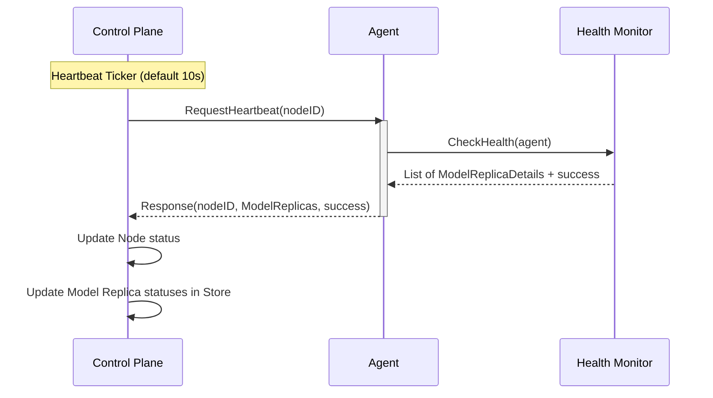

# Heartbeat Mechanism

The heartbeat mechanism in Edgernetes-AI is a critical component for monitoring the health and status of edge nodes and their assigned model replicas. It ensures high availability and reliable orchestration of AI workloads across the edge cluster.

## Architecture

The system employs a **pull-based (polling)** heartbeat model. The Control Plane periodically initiates requests to each registered edge agent to retrieve its current status.

### Why Pull-based?
- **Centralized Control**: The Control Plane manages the frequency and timing of health checks.
- **Firewall Traversal**: Agents typically sit behind edge firewalls and can be reached via established control-plane-to-node connectivity.
- **Congestion Control**: Prevents the Control Plane from being overwhelmed by simultaneous push events from hundreds of agents.

## gRPC Service Definition

The heartbeat interface is defined in [heartbeat.proto](../api/proto/heartbeat.proto).

```protobuf
service HeartbeatAPI {
    rpc RequestHeartbeat(RequestHeartbeatRequest) returns (RequestHeartbeatResponse);
}

message RequestHeartbeatRequest {
    string nodeID = 1;
}

message RequestHeartbeatResponse {
    string nodeID = 1;
    repeated ModelReplicaDetails ModelReplicas = 2;
    bool success = 3;
}
```

## Workflow Sequence



## Component Roles

### 1. Control Plane Implementation
The control plane logic resides in `internal/control-plane/controller/heartbeat/heartbeat.go`.

- **Periodic Handler**: `StartHeartbeatHandler` runs a ticker (default 10s) that calls `HandleHeartbeat`.
- **Node Polling**: Iterates through all nodes with `StatusOnline` or `StatusUnknown`.
- **Status Updates**:
    - If a node responds, its status is verified as `Online`.
    - If a node fails to respond for more than **40 seconds**, its status is transitioned to `Offline`.
    - If a node fails a single heartbeat but is within the 40s window, it is marked as `Unknown`.
- **Replica Sync**: The response includes details for all model replicas running on the node. The Control Plane synchronizes its internal store with these reported statuses (e.g., `pending`, `running`, `failed`).

### 2. Agent Implementation
The agent implementation resides in `internal/agent/api/grpc/monitor.go` and `cmd/agent/main.go`.

- **Health Checks**: When a heartbeat request is received, the agent invokes `agentmonitor.CheckHealth` and records the time of the heartbeat request (`LastHeartbeat`).
- **Status Reporting**: The agent reports the status of every assigned model replica, including:
    - `replica_id`
    - `status` (Running, Failed, etc.)
    - `instance_count` (Current worker pool size)
    - Error codes and messages if applicable.
- **Fail-Safe Recovery**: A background goroutine continuously (every 30 seconds) monitors the `LastHeartbeat` timestamp. If no heartbeat request from the Control Plane is received for more than **60 seconds** (e.g., due to Control Plane restart or temporary network partition), the agent assumes it has been marked as offline and automatically initiates a deregistration followed by a re-registration with the Control Plane.

## Health Statuses

### Node Statuses
- **Online**: Node is reachable and responding to heartbeats.
- **Unknown**: Node missed a heartbeat but the timeout (40s) hasn't expired.
- **Offline**: Node has missed heartbeats for >40s.

### Replica Statuses
- **Pending**: Model is being pulled or loaded.
- **Running**: AI model is active and serving requests.
- **Failed**: Error occurred during load or execution.
- **Completed**: Task-based model finished execution.
